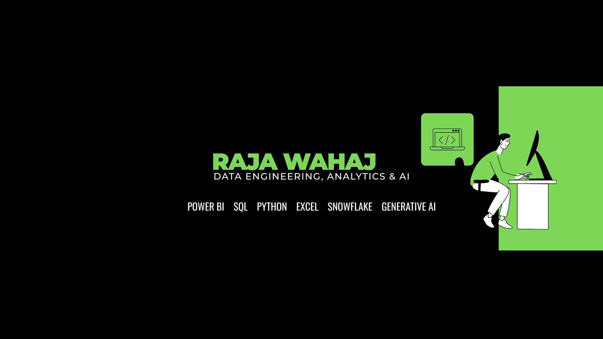

  

# Hi there! I'm Raja Wahaj 👋

💡 **Data Analyst | Data Engineer | Power BI | Python | SQL | Snowflake | Generative AI**

Welcome to my GitHub profile! Here I showcase my data projects, dashboards, and analytics work.

---

## 🌐 Connect with me

---

## 🛠️ Languages and Tools

---

## 📊 GitHub Stats

  

  

---

## 🚀 Featured Projects

- 📈 **Sales Dashboard in Power BI**
- 🧹 **Data Cleaning & EDA with Pandas**
- 🗃️ **SQL Data Warehouse Project**
- ❄️ **Snowflake ELT Pipeline**
- 🤖 **Generative AI Data Assistant**

---

## 🧠 Currently Learning

- Advanced Data Engineering Patterns
- dbt & Modern Data Stack
- LLM + Data Applications

---

## ⚡ Fun Fact

> “Without data, you're just another person with an opinion.”
